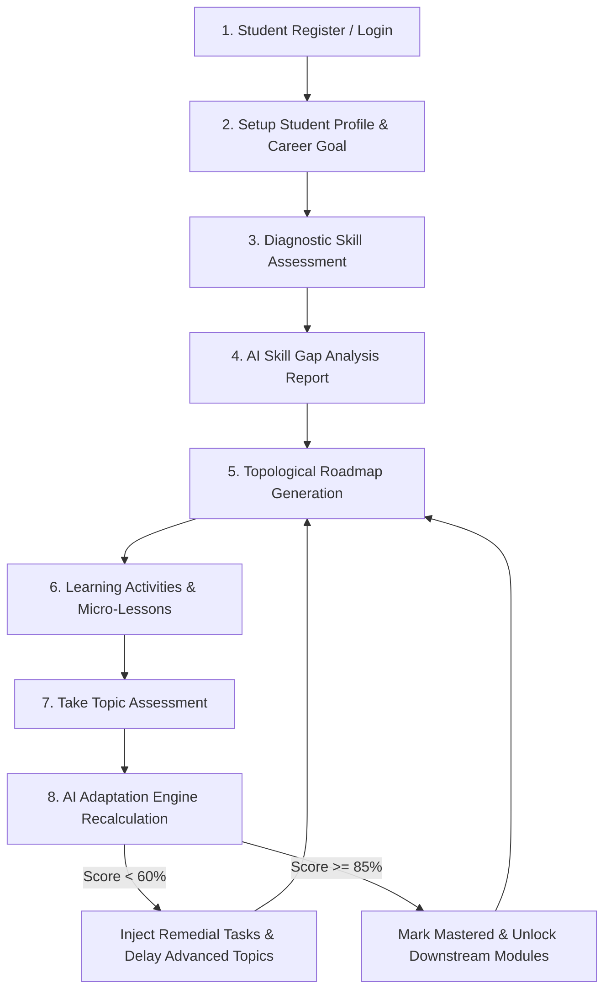

# Adaptive AI-Based Personalized Learning Path & Roadmap Generation System

A complete, modern web application designed to help students achieve their selected career goals by generating an adaptive, personalized learning roadmap. The system continuously evaluates baseline student skills, diagnostic test performance, prerequisite dependencies, and daily available study hours to dynamically re-sequence topics, inject remedial practice, and accelerate mastered modules.

---

## Key Features

1. **Student Registration & Login**: Account management supporting Student and Admin/Faculty roles with pre-seeded demo credentials.
2. **Student Profile & Goal Setting**: Career goal selection (Java Developer, Full Stack Developer, Data Scientist, AI/ML Engineer, Cybersecurity Engineer, Android Developer), target role, academic year, CGPA, available daily study hours, and learning style.
3. **AI Skill Gap Analysis**: Compares student baseline & assessment scores against target role required skills using Scikit-Learn TF-IDF vector similarity and classifies skills as **Strong**, **Average**, **Weak**, or **Missing Prerequisite**.
4. **Prerequisite Topological Roadmap**: Generates a Directed Acyclic Graph (DAG) of topic nodes respecting strict prerequisites (e.g., Programming Fundamentals → Java Basics → OOP Concepts → Spring Boot).
5. **Dynamic AI Adaptation Engine**: Real-time roadmap recalculation after every assessment submission:
   - **High Score (>=85%)**: Topic marked as *Mastered*, unlocks downstream modules, reduces revision hours.
   - **Low Score (<60%)**: Topic marked as *Weak*, injects remedial practice tasks, elevates priority, delays dependent topics.
6. **Learning Activity Recommendations**: Custom curated video links, reading guides, practice quizzes, coding exercises, and mini projects for each weak or missing skill.
7. **Interactive Dashboard & Radar Charts**: Chart.js radar graph, skill ratio doughnut chart, mastery bar chart, streak counter, and real-time AI recommendation feeds.
8. **Admin & Faculty Panel**: Enrolled student roster view, cohort performance analytics, and dynamic question bank management.

---

## Technology Stack

- **Backend**: Python 3.14+, Flask Web Framework (REST APIs & MVC routing)
- **Database**: SQLite 3 with 14 relational database models
- **AI/ML Engine**: Scikit-Learn (TF-IDF Vectorizer & Cosine Similarity) + Topological Sort DAG algorithm
- **Frontend**: HTML5, Vanilla CSS3 (Custom Design System, Dark/Light Theme toggle, Glassmorphism Cards), JavaScript (ES6+ Single Page Architecture)
- **Visualization**: Chart.js, Interactive SVG/CSS Roadmap Timeline Graph Nodes

---

## Quick Start / How to Run Locally

### Prerequisites
- Python 3.8 or higher installed on your computer.

### Step 1: Install Dependencies
Open your terminal in the project directory and run:
```bash
pip install flask scikit-learn numpy
```

### Step 2: Initialize Database (Pre-Seeded)
The application automatically initializes and seeds the SQLite database (`database.db`) on first launch with sample students, courses, topics, prerequisites, questions, and activities.

To manually re-seed the database at any time, run:
```bash
python seed_data.py
```

### Step 3: Launch Web Application
Run the Flask application server:
```bash
python app.py
```

Open your browser and navigate to:
[http://127.0.0.1:5000](http://127.0.0.1:5000)

---

## Pre-Seeded Demo Credentials

- **Student Account**:
  - Email: `student@example.com`
  - Password: `password123`
- **Admin / Faculty Account**:
  - Email: `admin@example.com`
  - Password: `admin123`

---

## Project Folder Structure

```
gym/
├── app.py                     # Main Flask Application & REST API Routes
├── database.py                # Database connection & SQLite queries helper
├── ai_engine.py               # Scikit-learn Vectorizer, Skill Gap & Adaptive Roadmap Engine
├── seed_data.py               # Pre-populates database with realistic initial data
├── schema.sql                 # SQL schema definitions for 14 tables
├── static/
│   ├── css/
│   │   └── styles.css         # Modern design system (Dark/Light themes, cards, layout)
│   └── js/
│       ├── main.js            # SPA Router, state manager, auth, quiz engine
│       ├── roadmap.js         # Interactive SVG/CSS Timeline Graph renderer
│       └── charts.js          # Chart.js radar, doughnut, and bar chart helper
├── templates/
│   └── index.html             # Single Page Application HTML shell
├── tests/
│   ├── test_ai_engine.py      # Automated tests for AI engine & topological sort
│   └── test_api.py            # Automated integration tests for Flask REST endpoints
└── README.md                  # Comprehensive Documentation
```

---

## Complete User Flow


